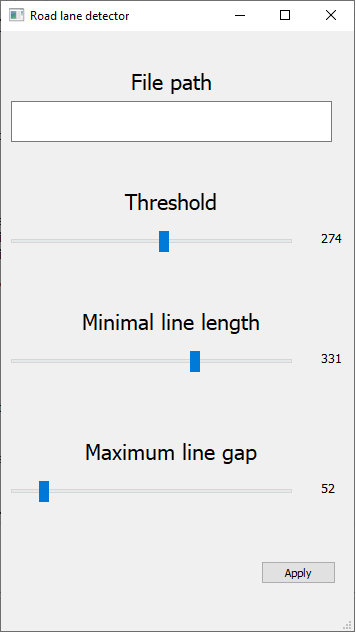

# Road lane detector

Using the GUI, the parameters of the HoughLinesP algorithm can be adjusted.

## Requirements
  - OpenCV
  - Numpy
  - PyQt5
 
## References
  - https://www.youtube.com/watch?v=yvfI4p6Wyvk
  - https://doc.qt.io/qtforpython/
  - https://docs.opencv.org/3.4/d9/db0/tutorial_hough_lines.html
